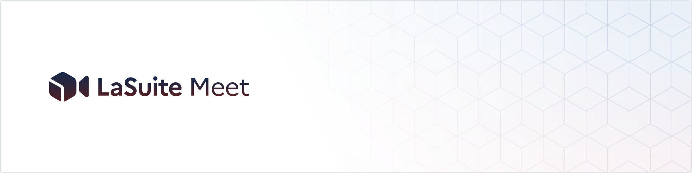

  

  
  
  
  
      

  <a href="https://livekit.io/">LiveKit</a> - <a href="https://matrix.to/#/#meet-official:matrix.org">Chat with us</a> - <a href="https://github.com/orgs/suitenumerique/projects/3/views/2">Roadmap</a> - <a href="https://github.com/suitenumerique/meet/blob/main/CHANGELOG.md">Changelog</a> - <a href="https://github.com/suitenumerique/meet/issues/new?assignees=&labels=bug&template=Bug_report.md">Bug reports</a> 

  

## La Suite Meet: Simple Video Conferencing

Powered by [LiveKit](https://livekit.io/), La Suite Meet offers Zoom-level performance with high-quality video and audio. No installation required—simply join calls directly from your browser. Check out LiveKit's impressive optimizations in their [blog post](https://blog.livekit.io/livekit-one-dot-zero/).
### Features
- Optimized for stability in large meetings (+100 p.)
- Support for multiple screen sharing streams
- Non-persistent, secure chat
- End-to-end encryption (coming soon)
- Meeting recording
- Meeting transcription (currently in beta)
- Telephony integration
- Secure participation with robust authentication and access control
- LiveKit Advances features including :
  - speaker detection 
  - simulcast 
  - end-to-end optimizations 
  - selective subscription
  - SVC codecs (VP9, AV1)

La Suite Meet is fully self-hostable and released under the MIT License, ensuring complete control and flexibility. It's simple to [get started](https://visio.numerique.gouv.fr/) or [request a demo](mailto:visio@numerique.gouv.fr). 

We’re continuously adding new features to enhance your experience, with the latest updates coming soon!

## Table of Contents

- [Get started](#get-started)
- [Docs](#docs)
- [Contributing](#contributing)
- [Philosophy](#philosophy)
- [Open source](#open-source)

## Get started

### La Suite Meet Cloud (Recommended)
Sign up for La Suite Meet Cloud, designed for french public servants. Hosted on SecNumCloud-compliant providers and accessible via government SSO, [ProConnect](https://www.proconnect.gouv.fr/). The easiest way to try our product. Reach out if your entity isn't connected yet to our sso.

### Open-source deployment (Advanced)

Deploy La Suite Meet on your own infrastructure using [our self-hosting guide](https://github.com/suitenumerique/meet/blob/main/docs/installation.md). Our open-source deployment is optimized for Kubernetes, and we're working on supporting additional deployment options. Keycloak integration and any SSO are supported. We offer customer support for open-source setups—just reach out for assistance.  

## Docs

We're currently working on both technical and user documentation for La Suite Meet. In the meantime, many of the essential aspects are already well covered by the [LiveKit documentation](https://docs.livekit.io/home/) and their [self-hosting guide](https://docs.livekit.io/home/self-hosting/deployment/). Stay tuned for more updates!

## Contributing

We <3 contributions of any kind, big and small:

- Vote on features or get early access to beta functionality in our [roadmap](https://github.com/orgs/suitenumerique/projects/3/views/2)
- Open a PR (see our instructions on [developing La Suite Meet locally](https://github.com/suitenumerique/meet/blob/main/docs/developping_locally.md))
- Submit a [feature request](https://github.com/suitenumerique/meet/issues/new?assignees=&labels=enhancement&template=Feature_request.md) or [bug report](https://github.com/suitenumerique/meet/issues/new?assignees=&labels=bug&template=Bug_report.md)

## Philosophy

We’re relentlessly focused on building the best open-source video conferencing product—La Suite Meet. Growth comes from creating something people truly need, not just from chasing metrics.

Our users come first. We’re committed to making La Suite Meet as accessible and easy to use as proprietary solutions, ensuring it meets the highest standards.

Most of the heavy engineering is handled by the incredible LiveKit team, allowing us to focus on delivering a top-tier product. We follow extreme programming practices, favoring pair programming and quick, iterative releases. Challenge our tech and architecture—simplicity is always our top priority.

## Open-source

Gov 🇫🇷 supports open source! This project is available under [MIT license](https://github.com/suitenumerique/meet/blob/0cc2a7b7b4f4821e2c4d9d790efa739622bb6601/LICENSE).

All features we develop will always remain open-source, and we are committed to contributing back to the LiveKit community whenever feasible.
To learn more, don't hesitate to [reach out](mailto:visio@numerique.gouv.fr).

### Help us!

Come help us make La Suite Meet even better. We're growing fast and [would love some help](mailto:visio@numerique.gouv.fr).

## Contributors 🧞

## Credits 

We're using the awesome [LiveKit](https://livekit.io/) implementation. We're also thankful to the teams behind [Django Rest Framework](https://www.django-rest-framework.org/), [Vite.js](https://vite.dev/), and [React Aria](https://github.com/adobe/react-spectrum) — Thanks for your amazing work!

## License

Code in this repository is published under the MIT license by DINUM (Direction interministériel du numérique).
Documentation (in the docs/) directory is released under the [Etalab-2.0 license](https://spdx.org/licenses/etalab-2.0.html).

